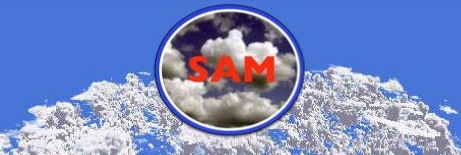

# Amazon Shallow Cumulus Forcings for LES/CRM and 1D models. 

This repositories contains the initial 
condition and the large-scale forcing 
to reproduce the Shallow Cumulus(ShCu)
convection in Central Amazon(CAMZ). 

The initial conditions, large-scale forcing, and surface 
fluxes for the Amazon ShCu data set were created, 
averaging data set from 30 representative 
cases of ShCu in CAMZ during the intesive operational period 1 and 2, IOP1 and IOP2 
respectively. This composite is called Amazon ShCu, its mass flux time 
evolution simulated by the System for Atmospheric
Modeling (SAM)  v.6.10.6 (Khairoutdinov & Randall, 2003) model is show in Fig.1. 

 

Figure1. The time evolution (average every 5 minutes) of the updraft mass flux (uMF) [kgm−2s−1] profiles
for the Amazon ShCu. The mixing layer height (Zi, black lines) is defined at the minimum buoyancy flux (B), cloud base
height [km] (Hbase, red dashed lines) at the maximum CF level, cloud top [km] (Htop, black dot-
ted lines) at the level where CLW<0.001 [gkg−1]  above cloud base and the
level of free convection (LFC [km], purple dashed lines) at the level where B>0, above Zi.

In order to study the factors for ShCu clouds growth, these 30 ShCu cases were classified 
into three categories, small, medium, and
large , according to their cloud-top height and depth, and their respectively composites were created.
The initial conditions, large-scale forcing, and surface 
fluxes for these composities is also availible 
The mass flux for these composites simulated using the SAM model is shown 
in Fig. 2. 

  
   
  

Figure2. The time evolution of the updraft mass flux (uMF) [kgm−2s−1] profiles
for small, medium and large ShCu composites. 

_____
## Data:

The data  was created to run in
the SAM and a versio to 
Single Column Atmospheric Model, version 6 (SCAM6) (Gettelman et al., 2019)

For the SAM model:

For the NCAR SCAM 6 model:

To find more information about the simulations and the composites criation 
visit the paper:

[Link to Amazon ShCU paper](https://doi.org/10.1002/essoar.10510700.2)

### References

Gettelman, A., Truesdale, J. E., Bacmeister, J. T., Caldwell, P. M., Neale, R. B., Bogenschutz, P. A., & Simpson, I. R. (2019). The Single Column Atmosphere Model version 6 (SCAM6): Not a scam but a tool for model evaluation and development. Journal of Advances in Modeling Earth Systems, 11, 1381– 1401. https://doi.org/10.1029/2018MS001578

Khairoutdinov, M. F., and D. A. Randall, 2003: Cloud Resolving Modeling of the ARM Summer 1997 IOP: Model Formulation, Results, Uncertainties, and Sensitivities. J. Atmos. Sci., 60, 607–625, https://doi.org/10.1175/1520-0469(2003)060<0607:CRMOTA>2.0.CO;2.
