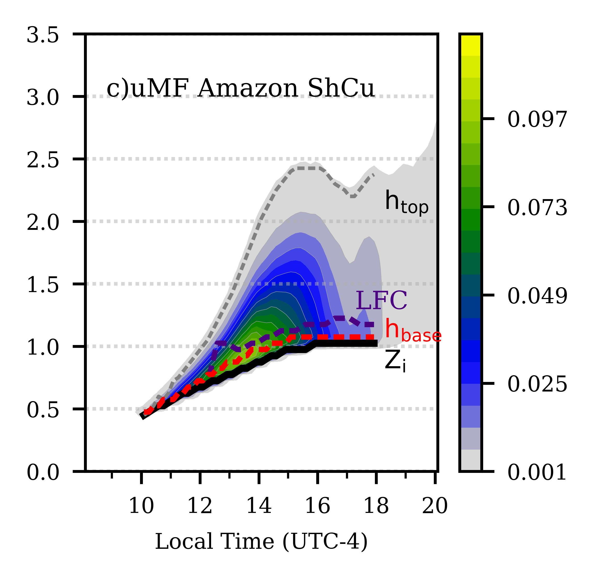
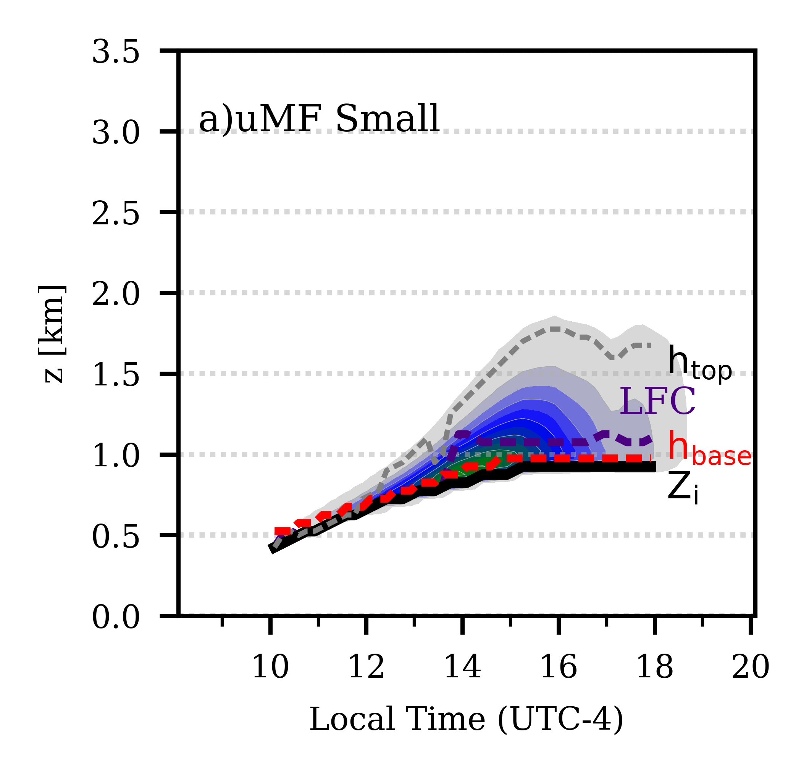
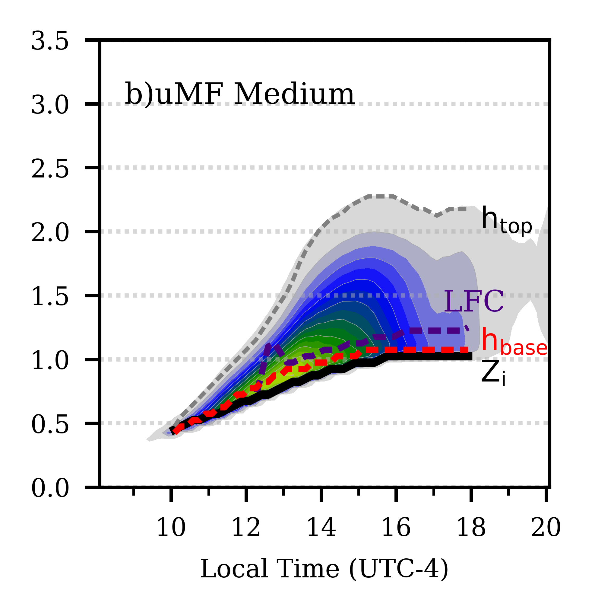
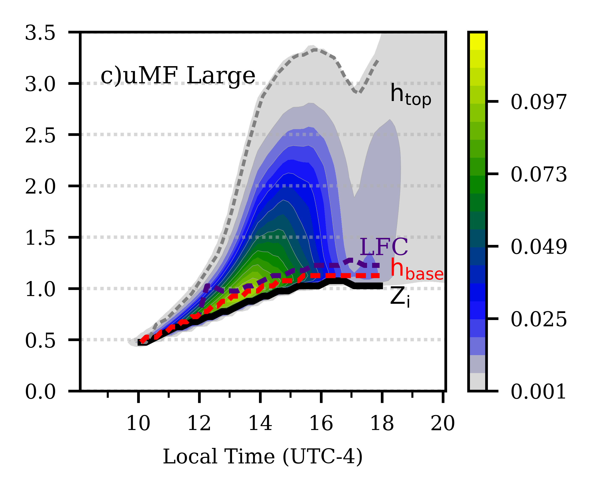

# Amazon_ShCu

This repositories contains the initial 
condition and the large-scale forcing 
to reproduce the Shallow Cumulus(ShCu)
convection in Central Amazon(CAMZ). 

The initial conditions, large-scale forcing, and surface 
fluxes for the Amazon ShCu data set were created, 
averaging data set from 30 representative 
cases of ShCu in CAMZ during the intesive operational period 1 and 2, IOP1 and IOP2 
respectively.

  
   
  

###3[Some title here](fig/mass_flux_2d_ca_sh.pdf)
_____________________________________________________________
Data:

The data  was created to run in
the System for Atmospheric153
Modeling (SAM) v.6.10.6 (Khairoutdinov & Randall, 2003).

Two dataset were created: 
